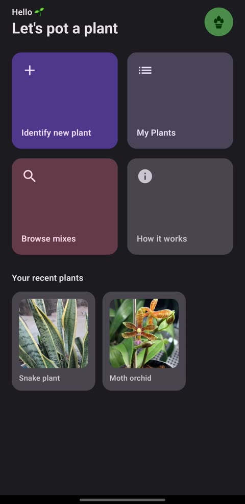
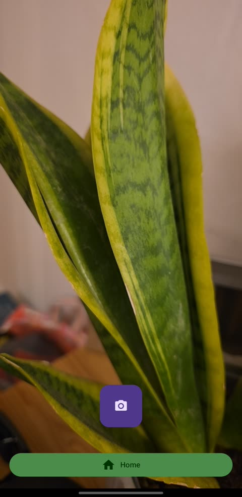
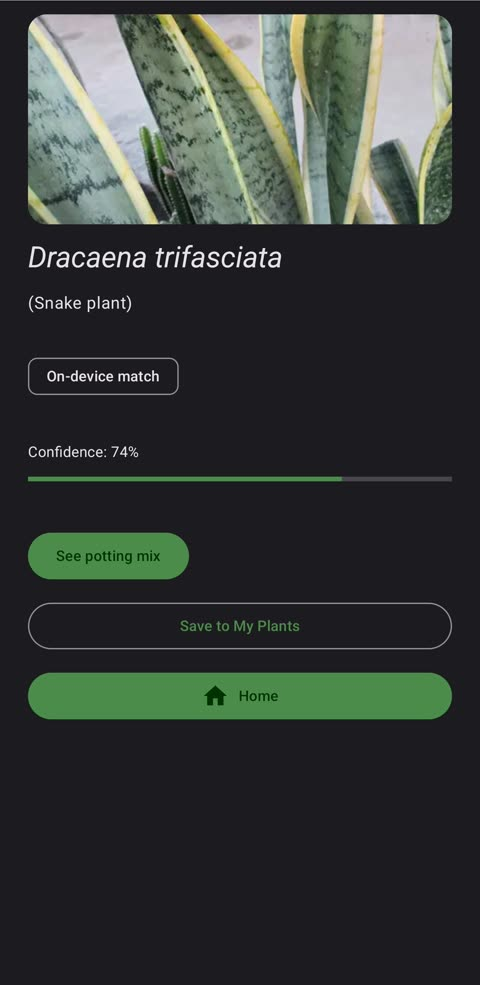
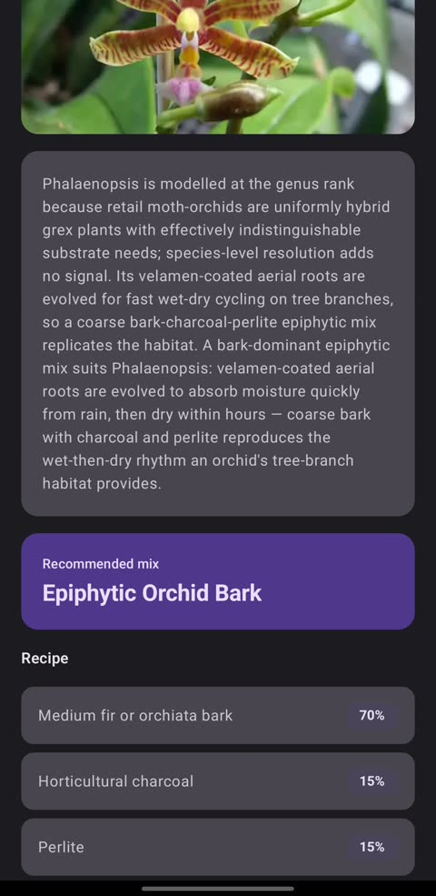
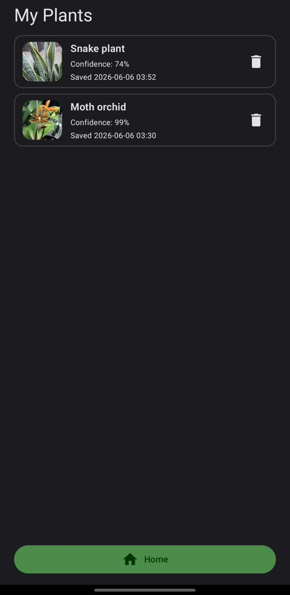
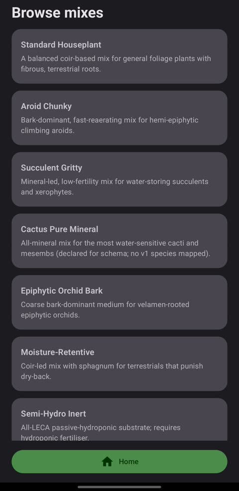

# PlantPotting
Houseplant Soil & Potting Guidance — Android app.
Built by Rob Evans (PM)

A small Android app that identifies a houseplant from a photo and recommends the right soil and substrate mix to repot it in, using on-device machine learning.

Built as a vehicle to apply what I'd learned about agentic engineering and to refine my own PM processes around AI-driven development, inspired by the software factory work at StrongDM (https://factory.strongdm.ai). (Also because I'd killed a few houseplants with the wrong potting mix!).

## How does the agentic harness work

The goal here was simple: explore the factors that build the best-quality product while observing two rules — **(1) code must not be written by humans, and (2) code must not be reviewed by humans.** What fills the gap those rules open up is a **skill-driven, multi-model pipeline** with explicit seams between phases. The work moves through a repeating cycle, each step a `/slash-command` skill, with the sprint ledger (`docs/sprints/ledger.yaml`) as the source of truth for which sprint is in which state:

```
   roadmap ──▶ sprint-planner ──▶ sprint-execute ──▶ sprint-review ──▶ (roadmap bump)
   (the long     (3 models draft,    (1 model builds    (I exercise the     ▲
    narrative)    critique, merge)     it, TDD-gated)     real app, log)      │
        └──────────────────────────────────────────────────────────────────┘
```

The phases are shaped around three convictions:
- **One model has one set of blind spots**, so:
  - *Planning* is multi-model: codex, gemini, and claude each produce an independent draft, then cross-critique each other, then Opus synthesizes the strongest plan. Not the average, the best of each. 
  - *Execution* is single-model (one implementer, so the diff stays coherent) under a strict brief: failing test first, integration tests mandatory, `- [ ]` → `- [x]` checkboxes flipped in the plan file as each task lands. 
- **The plan is the contract** — a checkbox list with explicit non-goals, risks, and acceptance criteria living on disk, so drift is visible rather than hiding in someone's head; each seam hands off through a gated `origin/main` so no phase can quietly lose a plan or a feedback file. 
- **I own "Product" choices** - Through all of it I keep my hand on the steering wheel: I owned the problem framing, the research and knowledge pyramid that sat behind the recommendations, and the product choices at every seam. Which intent concentrates into the next plan, what counts as "done," what gets deferred. The harness writes and tests the code; the **judgment about *what* to build and *whether it's right* stays mine.**

That last phase is where the learning loop closes. `sprint-review` walks me through exercising the **real** output. Running the app, hitting the live path, and captures structured feedback that becomes the *input* to the next sprint's intent. Offline gates (tests, lint, types) only prove the code is internally consistent; the bugs that actually mattered here surfaced when a human drove the live product, not from the test suite. Two cycles run in parallel: a Plan-Do-Learn loop on the **product**, and a second one on the **harness itself** — refining the process for working at the pace AI enables.

## How I validated it

Validation was personal and deliberate, not user-driven. The real question I was testing was whether I could run a Plan-Do-Learn cycle on the product alongside a separate Plan-Do-Learn cycle on the harness itself, one that accounted for the use of AI and the pace it enables.

## How to use

Open the app on its Home screen; tap **Identify new plant** and point the camera at a
houseplant; an on-device TensorFlow Lite model identifies the species; the app shows a
reference photo, a confidence reading, and a recipe-driven potting-mix recommendation drawn
from a bundled knowledge base. Save plants to **My Plants**, or **Browse mixes** by care type.

### Screenshots (v0.4.0)

| Home | Camera | Result |
| --- | --- | --- |
|  |  |  |

| Potting mix | My Plants | Browse mixes |
| --- | --- | --- |
|  |  |  |

## Current state (post PLANTPOTTING-0010, 2026-06-06)

Ten sprints landed on `main`:

| Sprint | Title | Status |
| --- | --- | --- |
| PLANTPOTTING-0001 | Android scaffold + end-to-end stub flow with KB | done |
| PLANTPOTTING-0002 | Fix sprint for 0001 review bugs | done |
| PLANTPOTTING-0003 | On-device ML identifier + Bug A fix + source-driven badge | done |
| PLANTPOTTING-0004 | Fix sprint for 0003 review bugs (UINT8 dtype + testTagsAsResourceId bridge) | done |
| PLANTPOTTING-0005 | Post-shutter polish + un-defer carry-forward from 0003/0004 | done (calibration mechanism + real-photo probe + integration-flow all landed — see [`docs/ROADMAP.md`](docs/ROADMAP.md)) |
| PLANTPOTTING-0006 | Second in-vocab calibration probe (crassula-ovata) + two UX fixes | done |
| PLANTPOTTING-0007 | Houseplant model swap (V1 entry) — survey, eval harness, running prototype | done |
| PLANTPOTTING-0008 | Training-data availability spike (gates fine-tuning) + camera-button UX fix | done |
| PLANTPOTTING-0009 | Text-only KB-expansion: +16 delta species (10→26 mapped), Pilea deferred | done |
| PLANTPOTTING-0010 | App-experience sprint: UI/UX refresh, persistence, My Plants, "Add this plant", +12 KB species (→38 mapped), CC0/PD reference photos | done (v0.4.0) |

What you can do today:

- **Start on a Home screen.** The app lands on a card-based Home (greeting, a 2×2
  tile grid — *Identify new plant* / *My Plants* / *Browse mixes* / *How it works* —
  and a "recent plants" carousel). A full-width **Home** button sits at the bottom of
  every screen.
- **Identify a plant on-device.** Camera capture → JPEG → House Plant Species
  MobileNetV2 TensorFlow Lite model (~10.9 MB, float16, 47 houseplant classes,
  bundled in `app/src/main/assets/ml/house_plant_species_mobilenetv2/` —
  PLANTPOTTING-0007). It maps **38 of its 47** model classes to KB care cards
  (PLANTPOTTING-0009 took it 10→26; PLANTPOTTING-0010 added 12 more popular-slice
  species; Pilea deferred), vs the AIY Plants V1/3 baseline's 5 — which stays bundled
  in `app/src/main/assets/ml/aiy_plants_v1/` as the regression anchor; the active model
  is selected by the `ACTIVE_MODEL_ROOT` `BuildConfig` switch. Inference runs entirely
  on-device; the network policy is enforced at build time by `verifyNoNetworking`.
- **Get a routing decision + confidence.** The model's top-1 score is compared to the
  threshold policy in `model_manifest.json`; the result is `ResultScreen`
  (high-confidence — now with a numeric **confidence % + progress bar**),
  `LowConfidencePicker` (model unsure / out-of-vocab — pick from a contained search
  list), or the **"Add this plant"** wireframe (strong but *unmapped* class — logs a
  local request tally).
- **See an evidence-tagged recommendation with a reference photo.** `ResultScreen`
  shows the plant's **CC0/PD reference image**, a source badge (`on-device match`,
  `on-device match (low confidence)`, or `stub identifier`), and the confidence.
  Tapping *See potting mix* loads `RecommendationScreen`: plant name + picture, a
  horticultural rationale, the named archetype (e.g. *Aroid Chunky*), and a recipe
  list whose proportions sum to 100%.
- **Save to My Plants.** An explicit Save action persists the plant to a local
  **DataStore** (the app's first persistence layer); **My Plants** lists saved plants
  with thumbnails, de-duplicates by species, and supports per-row removal.
- **Stub-only fallback** for development. `StubPlantIdentifier` returns a
  deterministic *Monstera deliciosa* and is what the GMD instrumentation
  tests run against by default (the real model is exercised by one dedicated
  `OnDeviceModelRealInterpreterTest`).

Architecture sketch:

```
camera capture (JPEG bytes)
        │
        ▼
PlantIdentifier (interface)
   ├── StubPlantIdentifier      ← deterministic, test default
   └── OnDevicePlantIdentifier  ← production
            │
            ▼
   ImagePreprocessor → TfLiteInterpreterFacade → ModelScoreMapper
            │   (House Plant Species MobileNetV2, FLOAT32; AIY V1/3 baseline also bundled)
            ▼
   IdentificationResult { speciesId, displayName, source, lowConfidence }
        │
        ▼
   high-conf (mapped)         → ResultScreen (reference photo + confidence + Save)
   high-conf (unmapped)       → "Add this plant" wireframe (local request tally)
   low-conf                   → LowConfidencePicker → ResultScreen (lowConfidence=true)
        │
        ▼
   RecommendationScreen (plant name + photo + KB-driven archetype + recipe)

   Home ─┬─ Identify (→ camera)     My Plants (DataStore-backed, save/remove)
         └─ Browse mixes (archetypes)   reference photos via PlantImageResolver
```

KB: `app/src/main/assets/kb/species.json` (44 species) and `archetypes.json`
(9 potting-mix archetypes). Validated at app start. Local persistence
(`persistence/PlantLogStore`, DataStore) backs My Plants + the add-request log.
CC0/PD reference imagery lives in `res/drawable-nodpi/` with attribution in
`docs/licenses/reference-images.md` (sourced by `scripts/source-reference-images.ps1`).

See [`docs/ROADMAP.md`](docs/ROADMAP.md) for layer status and the gap inventory.

## Prerequisites

- JDK 17 (Temurin or any LTS-17 distribution). The Gradle wrapper expects Java 17.
- Android SDK with platform 34 installed. Set `ANDROID_HOME` or `ANDROID_SDK_ROOT`.
- For instrumentation tests on the Gradle Managed Device (`pixel6Api34`), the
  host needs KVM (Linux) or WHPX/HAXM (Windows/macOS) and ~6 GB of free disk
  for the AOSP system image.

## First-time setup (Windows)

If you've never built this project before, follow these steps in order.

### 1. JDK 17

Install Temurin 17 from <https://adoptium.net/> or via winget:

```powershell
winget install EclipseAdoptium.Temurin.17.JDK
```

Verify:

```powershell
java -version    # should report 17.x
```

If `java` resolves to something else, set `JAVA_HOME` to the Temurin install
dir and put `%JAVA_HOME%\bin` on `PATH`.

### 2. Android Studio (recommended) or standalone SDK

The simplest path is Android Studio — it bundles the SDK manager, emulator,
and AVD manager into one installer:

```powershell
winget install Google.AndroidStudio
```

Launch it once and let the setup wizard install the default SDK. Then open
**SDK Manager** (Settings → Languages & Frameworks → Android SDK) and install:

- **SDK Platforms** tab: *Android 14.0 ("UpsideDownCake") API 34*
- **SDK Tools** tab: *Android SDK Build-Tools 34*, *Android SDK Command-line
  Tools (latest)*, *Android SDK Platform-Tools*, *Android Emulator*

After install, set the environment variable so the Gradle build can find the
SDK, **and** put `platform-tools` on `PATH` so `adb` works from any shell
(the `integration-flow.ps1` script resolves `adb` either way, but manual
`adb` invocations need it):

```powershell
setx ANDROID_HOME "$env:LOCALAPPDATA\Android\Sdk"
setx PATH "$env:PATH;$env:LOCALAPPDATA\Android\Sdk\platform-tools"
```

Open a fresh terminal (env-var changes need a new shell) and verify:

```powershell
echo $env:ANDROID_HOME
adb version
```

If `adb` isn't on `PATH` for some reason, use the full path directly:

```powershell
& "$env:LOCALAPPDATA\Android\Sdk\platform-tools\adb.exe" version
```

### 3. Hardware acceleration (WHPX)

The emulator needs WHPX to boot in seconds instead of minutes. Check whether
it's on:

```powershell
# Run this in an *elevated* PowerShell:
Get-WindowsOptionalFeature -Online -FeatureName HypervisorPlatform | Select State
```

If `State` isn't `Enabled`, enable it from the same elevated shell and reboot:

```powershell
Enable-WindowsOptionalFeature -Online -FeatureName HypervisorPlatform -All
```

WHPX coexists with Docker Desktop / WSL2; you don't have to choose.

### 4. Create the AVD

In Android Studio: **Device Manager → Create Virtual Device**.

- Hardware: *Pixel 6*
- System image: *API 34 ("UpsideDownCake") with **Google APIs***
  (the Google APIs image has a synthetic camera; the plain AOSP image, which
  Gradle Managed Device uses, doesn't)
- Click *Finish*, then the play button to boot it.

A first cold boot takes ~60 seconds. Leave the emulator running between
gradle runs.

### 5. First build

From the repo root with the emulator running:

```powershell
./gradlew.bat assembleDebug
```

The first run downloads Gradle 8.9 and the AGP plugin chain — expect 5–10
minutes. Subsequent runs are seconds.

## Daily commands

Run these from the repo root. PowerShell is the assumed shell on Windows. Substitute
`./gradlew` for `./gradlew.bat` if you're using bash.

### Build the debug APK

```powershell
./gradlew.bat assembleDebug
```

The APK lands at `app/build/outputs/apk/debug/app-debug.apk`.

### Run JVM unit tests

```powershell
./gradlew.bat testDebugUnitTest
```

These don't need an emulator. They cover the KB validator, recommendation
engine, ViewModels, Robolectric-backed Compose UI tests, the
`ModelManifest` / `ImagePreprocessor` / `InterpreterFacade` contract tests,
and the new dtype-rejection / shape-contract / `testTagsAsResourceId` bridge
tests added in PLANTPOTTING-0004.

### Install and run on the booted emulator (manual walk-through)

```powershell
./gradlew.bat installDebug
adb shell am start -n com.darkfactory.plantpotting/.MainActivity
```

(If `adb` isn't on `PATH`, use
`& "$env:LOCALAPPDATA\Android\Sdk\platform-tools\adb.exe" shell am start …`.)

Then walk through the flow on the emulator:

1. Tap **Grant camera access** on the permission screen.
2. On the camera preview, tap the shutter.
3. **One of two outcomes**, both expected and correct:
   - **High-confidence path:** lands on `ResultScreen` directly with source
     badge `on-device match`. Most common when the model is confident
     (real-device photo of an in-vocabulary species — the House Plant Species
     model covers 10 of the 16 KB species, e.g. *Monstera deliciosa*, snake
     plant, ZZ, peace lily, jade).
   - **Low-confidence path:** lands on `LowConfidencePicker`. The model
     couldn't pick a single species above its threshold — 6 of the 16 KB
     species are still out-of-vocab, and the AOSP emulator's synthetic camera
     scene rarely passes the threshold anyway. Pick a species row to continue.
     `ResultScreen` shows next with badge `on-device match (low confidence)`.
4. Tap **See potting mix** → `RecommendationScreen`. Archetype name, rationale,
   and a recipe table with proportions summing to 100%.
5. Tap **Retake** to return to the camera.

### Device-aware end-to-end smoke (the recommended health check)

```powershell
pwsh ./scripts/integration-flow.ps1
```

What this does: builds the debug APK (+ runs `verifyNoNetworking`), inspects
the APK contents to confirm the model + KB assets are bundled, installs to
the booted emulator, grants `CAMERA`, drives the full §2.1 flow by tapping
`uiautomator dump` coordinates (handles both the high-conf and low-conf
paths), reads back the source badge and recipe-row count, writes an
integration manifest, and diffs it against
`docs/sprints/expected-artifacts/PLANTPOTTING-0001.txt`. Expected final
line: `Integration manifest diff passed.`

Build-only mode (skips the device, useful for offline checks):

```powershell
pwsh ./scripts/integration-flow.ps1 -BuildOnly
```

The build-only manifest is diffed against
`docs/sprints/expected-artifacts/PLANTPOTTING-0001-buildonly.txt`.

### Run instrumentation tests against the booted emulator

```powershell
./gradlew.bat connectedDebugAndroidTest
```

Faster than the GMD path because the emulator is already warm. Use this for
local iteration.

### Run instrumentation tests via Gradle Managed Device

```powershell
./gradlew.bat pixel6Api34DebugAndroidTest
```

What CI runs. Boots a headless AOSP `pixel6Api34` emulator from scratch each
time. First run downloads the AOSP system image (~2 GB). Includes
`OnDeviceModelRealInterpreterTest`, which exercises the real `.tflite` model
through the full preprocessing + inference + dequantization pipeline (the
gate that closes Bug 1 from PLANTPOTTING-0003).

### Lint and style

```powershell
./gradlew.bat lint ktlintCheck
```

### Stub-isolation check (must stay green)

```bash
bash scripts/check-stub-isolation.sh
```

Asserts `StubPlantIdentifier` is referenced only from the
`identify/` package and never leaks into production wiring or unrelated
modules. Bash-only (Git Bash on Windows). In PowerShell, chain the two
commands on separate statements — don't append `bash …` to the same
`gradlew` line, PowerShell will read it as a gradle task name:

```powershell
./gradlew.bat assembleDebug testDebugUnitTest lint ktlintCheck verifyNoNetworking
bash scripts/check-stub-isolation.sh
```

### Full pre-PR check

```powershell
./gradlew.bat assembleDebug testDebugUnitTest lint ktlintCheck pixel6Api34DebugAndroidTest verifyNoNetworking
bash scripts/check-stub-isolation.sh
pwsh ./scripts/integration-flow.ps1
pwsh ./scripts/integration-flow.ps1 -BuildOnly
```

Convenience: `pwsh ./scripts/check-android.ps1` runs the gradle gate chain
in one go (it does not include the integration-flow scripts).

### Install on a connected physical device

Same command — `adb` finds the device:

```powershell
./gradlew.bat installDebug
```

Or directly:

```powershell
adb install -r app/build/outputs/apk/debug/app-debug.apk
```

## Sprint workflow

Sprints are planned, executed, and reviewed via local skills (gitignored;
see `.claude/CLAUDE.md`):

- **`/sprint-planner`** — multi-model planning. Generates
  `docs/sprints/{SID}.md`.
- **`/sprint-execute`** — hands the plan to opus / gpt-5.4 / gemini.
- **`/sprint-review`** — guides the user through testing and captures
  feedback to `docs/sprints/feedback/{SID}/feedback.md`.

The ledger at `docs/sprints/ledger.yaml` tracks per-sprint status; results
docs at `docs/sprints/results/{SID}.md` are the per-sprint state snapshot.

Project conventions in `.claude/CLAUDE.md`:

- `.claude/skills/` is gitignored. A fresh clone has the skills missing —
  install them locally before `/sprint-*` works.
- npm `.ps1` shims are broken on the developer machine; sub-spawns of
  `claude` and `gh` from bash use full paths.
