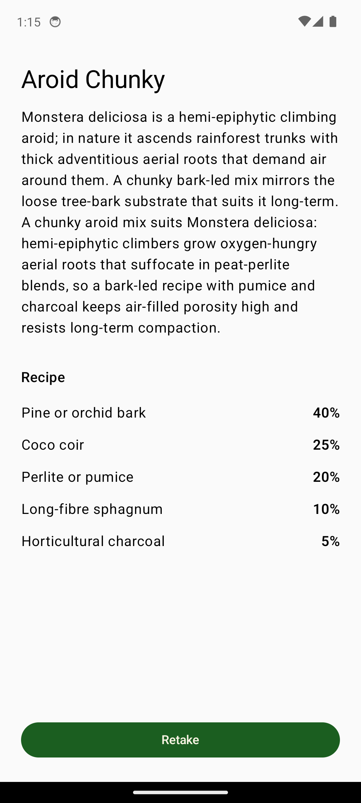

# PlantPotting
Houseplant Soil & Potting Guidance — Android app.
Built by Rob Evans (PM)

A small Android app that identifies a houseplant from a photo and recommends the right soil and substrate mix to repot it in, using on-device machine learning.

Built as a vehicle to apply what I'd learned about agentic engineering and to refine my own PM processes around AI-driven development, inspired by the software factory work at StrongDM (https://factory.strongdm.ai). (Also because I'd killed a few houseplants with the wrong potting mix!).

## What I drove, and what the harness did

The agentic Claude Code harness wrote and tested the code. I owned the problem framing, the research and knowledge pyramid that sat behind the model and recommendations, and the structure of the sprint plan-execute-review cycle that kept the work coherent across iterations.

## How I validated it

Validation was personal and deliberate, not user-driven. The real question I was testing was whether I could run a Plan-Do-Learn cycle on the product alongside a separate Plan-Do-Learn cycle on the harness itself, one that accounted for the use of AI and the pace it enables.

## How to use

Point the in-app camera at a houseplant; an on-device TensorFlow Lite model
identifies the species; the app surfaces a recipe-driven potting-mix
recommendation drawn from a bundled knowledge base. 

<p align="center"></p>

## Current state (post PLANTPOTTING-0005 mechanism, 2026-05-16)

Five sprints in flight on `main`:

| Sprint | Title | Status |
| --- | --- | --- |
| PLANTPOTTING-0001 | Android scaffold + end-to-end stub flow with KB | done |
| PLANTPOTTING-0002 | Fix sprint for 0001 review bugs | done |
| PLANTPOTTING-0003 | On-device ML identifier + Bug A fix + source-driven badge | done |
| PLANTPOTTING-0004 | Fix sprint for 0003 review bugs (UINT8 dtype + testTagsAsResourceId bridge) | done |
| PLANTPOTTING-0005 | Post-shutter polish + un-defer carry-forward from 0003/0004 | in-progress (mechanism + tests landed; real-photo probe + GMD gates pending — see [`docs/ROADMAP.md`](docs/ROADMAP.md)) |

What you can do today:

- **Identify a plant on-device.** Camera capture → JPEG → AIY Plants V1/3
  TensorFlow Lite model (~5 MB, UINT8-quantized, bundled in
  `app/src/main/assets/ml/aiy_plants_v1/`). Inference runs entirely on-device;
  the network policy is enforced at build time by `verifyNoNetworking`.
- **Get a routing decision.** The model's top-1 score is compared to the
  per-class threshold in `model_manifest.json`; the result is either
  `ResultScreen` (high-confidence direct match) or `LowConfidencePicker`
  (model unsure or species not in the AIY vocabulary — the user picks from a
  short list).
- **See an evidence-tagged recommendation.** `ResultScreen` shows a source
  badge — `on-device match`, `on-device match (low confidence)`, or
  `stub identifier` — so the UI never lies about how the species was
  identified. Tapping *See potting mix* loads `RecommendationScreen`: a named
  archetype (e.g. *Aroid Chunky*), a horticultural rationale, and a recipe
  list whose proportions sum to 100%.
- **Stub-only fallback** for development. `StubPlantIdentifier` returns a
  deterministic *Monstera deliciosa* and is what the GMD instrumentation
  tests run against by default (the real model is exercised by one dedicated
  `OnDeviceModelRealInterpreterTest`).

Architecture sketch:

```
camera capture (JPEG bytes)
        │
        ▼
PlantIdentifier (interface)
   ├── StubPlantIdentifier      ← deterministic, test default
   └── OnDevicePlantIdentifier  ← production
            │
            ▼
   ImagePreprocessor → TfLiteInterpreterFacade → ModelScoreMapper
            │              (AIY Plants V1/3, UINT8 in + out)
            ▼
   IdentificationResult { speciesId, displayName, source, lowConfidence }
        │
        ▼
   high-conf → ResultScreen
   low-conf  → LowConfidencePicker → ResultScreen (lowConfidence=true)
        │
        ▼
   RecommendationScreen (KB-driven archetype + recipe)
```

KB: `app/src/main/assets/kb/species.json` (16 species) and `archetypes.json`
(potting-mix recipes). Validated at app start.

See [`docs/ROADMAP.md`](docs/ROADMAP.md) for layer status and the gap inventory.

## Prerequisites

- JDK 17 (Temurin or any LTS-17 distribution). The Gradle wrapper expects Java 17.
- Android SDK with platform 34 installed. Set `ANDROID_HOME` or `ANDROID_SDK_ROOT`.
- For instrumentation tests on the Gradle Managed Device (`pixel6Api34`), the
  host needs KVM (Linux) or WHPX/HAXM (Windows/macOS) and ~6 GB of free disk
  for the AOSP system image.

## First-time setup (Windows)

If you've never built this project before, follow these steps in order.

### 1. JDK 17

Install Temurin 17 from <https://adoptium.net/> or via winget:

```powershell
winget install EclipseAdoptium.Temurin.17.JDK
```

Verify:

```powershell
java -version    # should report 17.x
```

If `java` resolves to something else, set `JAVA_HOME` to the Temurin install
dir and put `%JAVA_HOME%\bin` on `PATH`.

### 2. Android Studio (recommended) or standalone SDK

The simplest path is Android Studio — it bundles the SDK manager, emulator,
and AVD manager into one installer:

```powershell
winget install Google.AndroidStudio
```

Launch it once and let the setup wizard install the default SDK. Then open
**SDK Manager** (Settings → Languages & Frameworks → Android SDK) and install:

- **SDK Platforms** tab: *Android 14.0 ("UpsideDownCake") API 34*
- **SDK Tools** tab: *Android SDK Build-Tools 34*, *Android SDK Command-line
  Tools (latest)*, *Android SDK Platform-Tools*, *Android Emulator*

After install, set the environment variable so the Gradle build can find the
SDK, **and** put `platform-tools` on `PATH` so `adb` works from any shell
(the `integration-flow.ps1` script resolves `adb` either way, but manual
`adb` invocations need it):

```powershell
setx ANDROID_HOME "$env:LOCALAPPDATA\Android\Sdk"
setx PATH "$env:PATH;$env:LOCALAPPDATA\Android\Sdk\platform-tools"
```

Open a fresh terminal (env-var changes need a new shell) and verify:

```powershell
echo $env:ANDROID_HOME
adb version
```

If `adb` isn't on `PATH` for some reason, use the full path directly:

```powershell
& "$env:LOCALAPPDATA\Android\Sdk\platform-tools\adb.exe" version
```

### 3. Hardware acceleration (WHPX)

The emulator needs WHPX to boot in seconds instead of minutes. Check whether
it's on:

```powershell
# Run this in an *elevated* PowerShell:
Get-WindowsOptionalFeature -Online -FeatureName HypervisorPlatform | Select State
```

If `State` isn't `Enabled`, enable it from the same elevated shell and reboot:

```powershell
Enable-WindowsOptionalFeature -Online -FeatureName HypervisorPlatform -All
```

WHPX coexists with Docker Desktop / WSL2; you don't have to choose.

### 4. Create the AVD

In Android Studio: **Device Manager → Create Virtual Device**.

- Hardware: *Pixel 6*
- System image: *API 34 ("UpsideDownCake") with **Google APIs***
  (the Google APIs image has a synthetic camera; the plain AOSP image, which
  Gradle Managed Device uses, doesn't)
- Click *Finish*, then the play button to boot it.

A first cold boot takes ~60 seconds. Leave the emulator running between
gradle runs.

### 5. First build

From the repo root with the emulator running:

```powershell
./gradlew.bat assembleDebug
```

The first run downloads Gradle 8.9 and the AGP plugin chain — expect 5–10
minutes. Subsequent runs are seconds.

## Daily commands

Run these from the repo root (`D:\DarkFactoryProject\Plant potting` on the
developer's machine). PowerShell is the assumed shell on Windows. Substitute
`./gradlew` for `./gradlew.bat` if you're using bash.

### Build the debug APK

```powershell
./gradlew.bat assembleDebug
```

The APK lands at `app/build/outputs/apk/debug/app-debug.apk`.

### Run JVM unit tests

```powershell
./gradlew.bat testDebugUnitTest
```

These don't need an emulator. They cover the KB validator, recommendation
engine, ViewModels, Robolectric-backed Compose UI tests, the
`ModelManifest` / `ImagePreprocessor` / `InterpreterFacade` contract tests,
and the new dtype-rejection / shape-contract / `testTagsAsResourceId` bridge
tests added in PLANTPOTTING-0004.

### Install and run on the booted emulator (manual walk-through)

```powershell
./gradlew.bat installDebug
adb shell am start -n com.darkfactory.plantpotting/.MainActivity
```

(If `adb` isn't on `PATH`, use
`& "$env:LOCALAPPDATA\Android\Sdk\platform-tools\adb.exe" shell am start …`.)

Then walk through the flow on the emulator:

1. Tap **Grant camera access** on the permission screen.
2. On the camera preview, tap the shutter.
3. **One of two outcomes**, both expected and correct:
   - **High-confidence path:** lands on `ResultScreen` directly with source
     badge `on-device match`. Most common when the model is confident
     (real-device photo of an in-vocabulary species like *Monstera deliciosa*
     or *Crassula ovata*).
   - **Low-confidence path:** lands on `LowConfidencePicker`. The model
     couldn't pick a single species above its threshold — the AIY V1/3 model
     covers only 2 of the 16 KB species verbatim, and the AOSP emulator's
     synthetic camera scene rarely passes that threshold. Pick a species row
     to continue. `ResultScreen` shows next with badge
     `on-device match (low confidence)`.
4. Tap **See potting mix** → `RecommendationScreen`. Archetype name, rationale,
   and a recipe table with proportions summing to 100%.
5. Tap **Retake** to return to the camera.

### Device-aware end-to-end smoke (the recommended health check)

```powershell
pwsh ./scripts/integration-flow.ps1
```

What this does: builds the debug APK (+ runs `verifyNoNetworking`), inspects
the APK contents to confirm the model + KB assets are bundled, installs to
the booted emulator, grants `CAMERA`, drives the full §2.1 flow by tapping
`uiautomator dump` coordinates (handles both the high-conf and low-conf
paths), reads back the source badge and recipe-row count, writes an
integration manifest, and diffs it against
`docs/sprints/expected-artifacts/PLANTPOTTING-0001.txt`. Expected final
line: `Integration manifest diff passed.`

Build-only mode (skips the device, useful for offline checks):

```powershell
pwsh ./scripts/integration-flow.ps1 -BuildOnly
```

The build-only manifest is diffed against
`docs/sprints/expected-artifacts/PLANTPOTTING-0001-buildonly.txt`.

### Run instrumentation tests against the booted emulator

```powershell
./gradlew.bat connectedDebugAndroidTest
```

Faster than the GMD path because the emulator is already warm. Use this for
local iteration.

### Run instrumentation tests via Gradle Managed Device

```powershell
./gradlew.bat pixel6Api34DebugAndroidTest
```

What CI runs. Boots a headless AOSP `pixel6Api34` emulator from scratch each
time. First run downloads the AOSP system image (~2 GB). Includes
`OnDeviceModelRealInterpreterTest`, which exercises the real `.tflite` model
through the full preprocessing + inference + dequantization pipeline (the
gate that closes Bug 1 from PLANTPOTTING-0003).

### Lint and style

```powershell
./gradlew.bat lint ktlintCheck
```

### Stub-isolation check (must stay green)

```bash
bash scripts/check-stub-isolation.sh
```

Asserts `StubPlantIdentifier` is referenced only from the
`identify/` package and never leaks into production wiring or unrelated
modules. Bash-only (Git Bash on Windows). In PowerShell, chain the two
commands on separate statements — don't append `bash …` to the same
`gradlew` line, PowerShell will read it as a gradle task name:

```powershell
./gradlew.bat assembleDebug testDebugUnitTest lint ktlintCheck verifyNoNetworking
bash scripts/check-stub-isolation.sh
```

### Full pre-PR check

```powershell
./gradlew.bat assembleDebug testDebugUnitTest lint ktlintCheck pixel6Api34DebugAndroidTest verifyNoNetworking
bash scripts/check-stub-isolation.sh
pwsh ./scripts/integration-flow.ps1
pwsh ./scripts/integration-flow.ps1 -BuildOnly
```

Convenience: `pwsh ./scripts/check-android.ps1` runs the gradle gate chain
in one go (it does not include the integration-flow scripts).

### Install on a connected physical device

Same command — `adb` finds the device:

```powershell
./gradlew.bat installDebug
```

Or directly:

```powershell
adb install -r app/build/outputs/apk/debug/app-debug.apk
```

## Sprint workflow

Sprints are planned, executed, and reviewed via local skills (gitignored;
see `.claude/CLAUDE.md`):

- **`/sprint-planner`** — multi-model planning. Generates
  `docs/sprints/{SID}.md`.
- **`/sprint-execute`** — hands the plan to opus / gpt-5.4 / gemini.
- **`/sprint-review`** — guides the user through testing and captures
  feedback to `docs/sprints/feedback/{SID}/feedback.md`.

The ledger at `docs/sprints/ledger.yaml` tracks per-sprint status; results
docs at `docs/sprints/results/{SID}.md` are the per-sprint state snapshot.

Project conventions in `.claude/CLAUDE.md`:

- `.claude/skills/` is gitignored. A fresh clone has the skills missing —
  install them locally before `/sprint-*` works.
- npm `.ps1` shims are broken on the developer machine; sub-spawns of
  `claude` and `gh` from bash use full paths.
